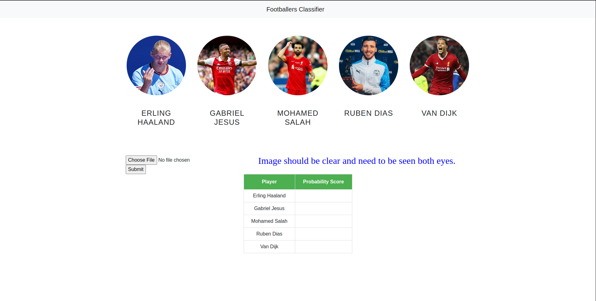
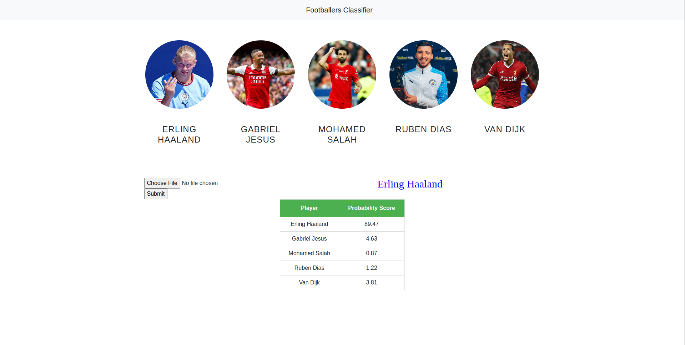

# FOOTBALLERS FACE RECOGNITION MODEL

### You should upload picture and it will predict which footballer is it (From given list)
### 

## Model File

 1. Model is trained using dataset 

 2. Using 'data_cleaning.ipynb' it's cleaning and cropping images 

 3. 'footballers_face_recognition_model.ipynb is creating model and saving it' 

## Server File

 1. 'server.py' is main flask app which you should run 

 2. You should upload image and it returns probability scores in HTML Table 

 3. Footballer image should have both eyes clearly visible 

## Main Page
### Footballers:

 1. Erling Haaland 

 2. Gabriel Jesus 

 3. Mohamed Salah 

 4. Ruben Dias 

 5. Van Dijk 

</img>

## Classified page
</img>